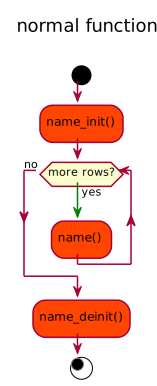
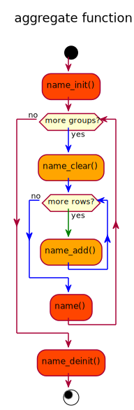

**May 2020** | **Wilhlem Liao**

Mysql UDF Plugin 初探
=====================
_Mysql plugin 有哪些？做什麼用途？ UDF 如何運作？_

-----------------------------------------------------------
#### 目錄
  - [認識 Mysql Plugins](#%e8%aa%8d%e8%ad%98-mysql-plugins)
    - [Plugin 類型](#plugin-%e9%a1%9e%e5%9e%8b)
    - [Plugin API](#plugin-api)
  - [Mysql UDF Plugin](#mysql-udf-plugin)
    - [初探 Mysql UDF Plugin](#%e5%88%9d%e6%8e%a2-mysql-udf-plugin)
    - [一個簡單的 UDF: hello()](#%e4%b8%80%e5%80%8b%e7%b0%a1%e5%96%ae%e7%9a%84-udf-hello)
  - [相關資源](#%e7%9b%b8%e9%97%9c%e8%b3%87%e6%ba%90)
  - [What's Next?](#whats-next)
-----------------------------------------------------------

## 認識 Mysql Plugins

_Mysql Plugin 用來擴充 Mysql 的行為，比如全文索引、驗證授權、資料庫引擎、以及 UDF (User Defined Function)。_

### Plugin 類型
> See https://dev.mysql.com/doc/refman/5.7/en/plugin-types.html

  * **Storage Engine Plugins**
  * **Full-Text Parser Plugins**
  * **Daemon Plugins**
  * INFORMATION_SCHEMA Plugins
  * Semisynchronous Replication Plugins
  * Audit Plugins
  * Authentication Plugins
  * Password-Validation Plugins
  * Protocol Trace Plugins
  * Query Rewrite Plugins
  * Keyring Plugins
  * **UDF Plugins**

[🔝回目錄](#%e7%9b%ae%e9%8c%84)


### Plugin API
> See https://dev.mysql.com/doc/refman/5.7/en/plugin-api.html

  * 由 C 語言寫成。
  * 能夠在 Server 啟動時載入 Plugin，或是在執行時動態載入或卸載 Plugin 而不需要重啟 Server。

[🔝回目錄](#%e7%9b%ae%e9%8c%84)


## Mysql UDF Plugin

  * 延伸 Mysql 函式，例如：<br/>
    ```sql
    SELECT my_function(b) FROM t1 WHERE a = 100;
    ```
  * 執行速度快<br/>
    https://www.percona.com/blog/2010/09/06/udf-vs-mysql-stored-function/
  * 可以自訂一般函式 (_normal_) 與聚合函式 (_aggregate_)。
  * 由 C 語言寫成。
    > 目前也有人用 go 寫，以 cgo 方式處理 :
    > * https://gist.github.com/BrianLeishman/1720c3c3d47b799d5dd913cedea654c5
    > * https://github.com/RebirthLee/mysql_udf_http_golang

  > **⚠**<br/>
    若 UDF crash，整個 Mysql/MariaDB Server 也會故障。

[🔝回目錄](#%e7%9b%ae%e9%8c%84)


### 初探 Mysql UDF Plugin

  **UDF 執行流程**

  |              |              |
  |--------------|--------------|
  |  <br/><br/><br/><br/><br/><br/><br/><br/><br/><br/> |  |

[🔝回目錄](#%e7%9b%ae%e9%8c%84)


### 一個簡單的 UDF: hello()

  我們期望這個 hello() 的 UDF 能進行以下操作：
  ```sql
  MariaDB [(none)]> SELECT `hello`('World');
  +------------------+
  | `hello`('World') |
  +------------------+
  | Hello, World!    |
  +------------------+
  1 row in set (0.000 sec)
  ```

  * Step 1: 建立一個檔案並命名 `lib_mysqludf_hello.c`，內容如下。
    ```c
    #include <stdio.h>
    #include <stdlib.h>
    #include <string.h>
    #include <inttypes.h>
    #include <stdbool.h>

    #include <mysql.h>

    /**********************************
      hello
      
      hello(name);
      
      RETURN string
    */

    my_bool
    hello_init(UDF_INIT *initid,
               UDF_ARGS *args,
               char     *message)
    {
      if (args->arg_count != 1) {
        strcpy(message, "requires one arguments.");
        return EXIT_FAILURE;
      }
      if (args->args[0] == NULL) {
        initid->ptr = NULL;
      } else {
        if (args->arg_type[0] != STRING_RESULT) {
          strcpy(message, "invalid arguments.");
          return EXIT_FAILURE;
        }
      }
      
      initid->maybe_null = 1;
      return EXIT_SUCCESS;
    }

    void
    hello_deinit(UDF_INIT *initid)
    {
      if (initid->ptr != NULL) {
        free(initid->ptr);
      }
    }

    char*
    hello(UDF_INIT      *initid,
          UDF_ARGS      *args,
          char          *result,
          unsigned long *length,
          char          *is_null,
          char          *error)
    {
      // check arguments
      if (args->args[0] == NULL) {
        *is_null = 1;
        return NULL;
      } else {
        if (args->arg_type[0] != STRING_RESULT) {
          // invalid arguments
          *error   = 1;
          return NULL;
        }
      }

      result = malloc(strlen(args->args[0]) + 8 + 1); 
      sprintf(result, "Hello, %s!", args->args[0]);

    final:
      if (result != NULL) {
        *length = strlen(result);
        initid->max_length = *length;
        initid->ptr = result;
      } else {
        *is_null = 1;
      }
      return result;
    }
    ```

  * Step 2: 編譯
    ```bash
    $ gcc -o lib_mysqludf_hello.so lib_mysqludf_hello.c `mariadb_config --cflags` -shared -fPIC -DMYSQL_DYNAMIC_PLUGIN
    ```

  * Step 3: 部署 so
    ```bash
    $ sudo cp lib_mysqludf_hello.so `mariadb_config --plugindir`
    ```

    查看是否有成功部署
    ```bash
    $ sudo ls `mariadb_config --plugindir`/lib_mysqludf_hello.so
    ```
    > 有成功的話，會回傳如下方的訊息。
    > `/usr/lib/mysql/plugin/lib_mysqludf_hello.so`

  * Step 4: 註冊到 MariaDB
     1. 登入 MariaDB
        ```bash
        $ sudo mysql -uroot
        ```

     2. 註冊 so 到 MariaDB
        ```sql
        MariaDB [(none)]> CREATE FUNCTION `hello` RETURNS STRING SONAME 'lib_mysqludf_hello.so';
        ```

     3. 進行檢驗
        ```sql
        MariaDB [(none)]> SELECT `hello`('World');
        +------------------+
        | `hello`('World') |
        +------------------+
        | Hello, World!    |
        +------------------+
        1 row in set (0.000 sec)
        ```

[🔝回目錄](#%e7%9b%ae%e9%8c%84)


## 相關資源
  - MySQL 5.1 Plugin Development, Packt Publishing, ISBN 978-1-849510-60-8
  - User-Defined Functions, https://mariadb.com/kb/en/user-defined-functions/
  - Adding Functions to MySQL, https://dev.mysql.com/doc/refman/5.7/en/adding-functions.html
  - Plugins, https://mariadb.com/kb/en/plugins/
  - Mysql UDF on Github, https://github.com/mysqludf
  - Extending MariaDB with user-defined functions, https://www.slideshare.net/MariaDB/extending-mariadb-with-userdefined-functions
  - Mysql Source Code Documentation, https://dev.mysql.com/doc/dev/mysql-server/latest/

[🔝回目錄](#%e7%9b%ae%e9%8c%84)


-----------------------------------------------------------
### What's Next?

  > ## **開發第一個 Mysql UDF Plugin**
  > 學習如何使用 Mysql UDF Plugin API 與開發技巧。

[🔝回目錄](#%e7%9b%ae%e9%8c%84)
